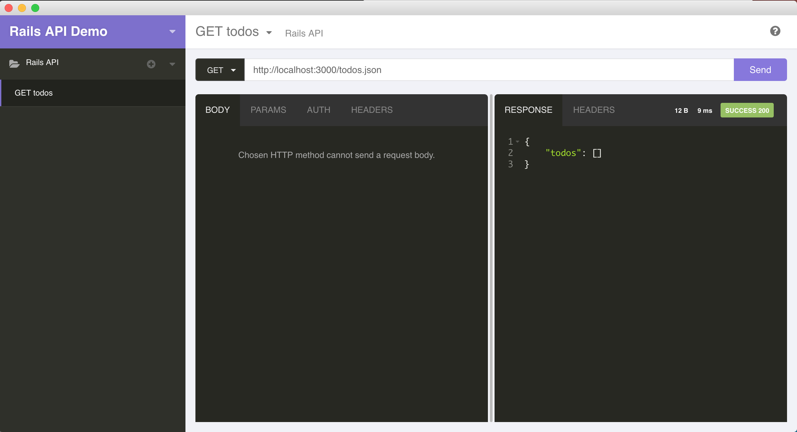
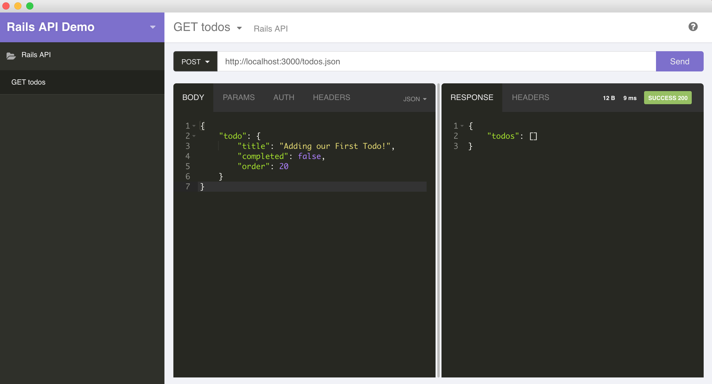
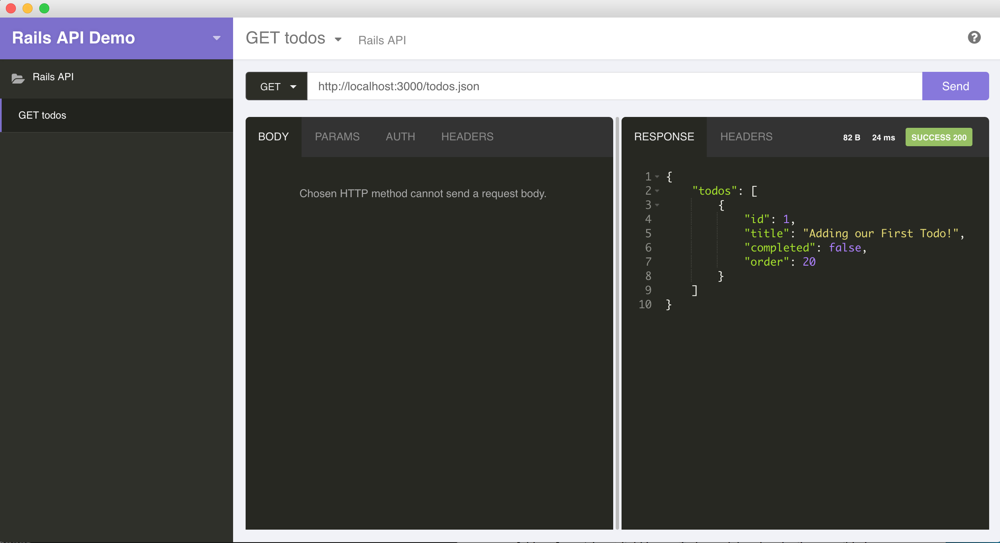

# Rails as a REST-ful API
In Unit 3 we're gonna learn how to create and consume an API. As an intro, we're gonna see what this looks like using Rails since you should be intimately familar with the framework by now. This Rails app will have no views, however, we'll test our API using [Insominia](https://chrome.google.com/webstore/detail/insomnia-rest-client/gmodihnfibbjdecbanmpmbmeffnmloel). Later, we'll use jQuery to access it and render data onto a page.

> The original idea behind Rails API was to serve as a starting point for a version of Rails better suited for JS-heavy apps. As of today, Rails API provides: trimmed down controllers and middleware stack together with a matching set of generators, all specifically tailored for API type applications.

You can actually check this out by going to an index view of your Project 2 and typing `.json` to the end of the URL. Note- this *should* work if you scaffolded your resources.

**Objectives**

- Create a Rails API to serve JSON data only (no views)
- Test our REST-ful endpoints using [Insominia](https://chrome.google.com/webstore/detail/insomnia-rest-client/gmodihnfibbjdecbanmpmbmeffnmloel)
- Consume our API using jQuery


## Let's get started with the Rails API...

Check out the [Rails API Gem](https://github.com/rails-api/rails-api) documentation.

2. Run `rails new my_api --api -d postgresql -T` to create a new API only Rails app.

2. Add the following lines to `config/env/development.rb`

  ```ruby
  # Add Rails 4.2 serverside rendered errors
  config.debug_exception_response_format = :default
  ```

3. Uncomment `rack-cors` in the `Gemfile` then `bundle install`:

[rack-cors](https://github.com/cyu/rack-cors) will help us with CORS request errors. Serialize will help us serve our data as a serialized JSON object.

## Let's scaffold a Todo resource

1. To scaffold our Todo resource:

	```ruby
	rails g scaffold todo title completed:boolean order:integer
	```

2. Run `rails db:create db:migrate`

3. Take a look at `controllers/todos_controller.rb`

	- What do you notice that's different from a regular scaffolded controller?
	- Which actions are we missing? Why?
	- Why do the actions only respond with JSON?

4.	 Next, check out `config/routes.rb` then run `rake routes`. What is different and why?

## Seed some todos with the Faker Gem

Now that we've set up our database/model/controller let's seed our database using the seeds.rb file and a gem called Faker generates dummy data to test your app (https://github.com/stympy/faker#fakername). 

- Add the `gem 'faker'` to the Gemfile around line 8 
- Run `bundle install`
- Add this to `db/seeds.rb`:

```ruby
10.times do
  Todo.create(
    title: Faker::Hipster.sentence(2),
    completed: Faker::Boolean.boolean(0.3),
    order: Faker::Number.number(4)
  )
end
```

- Run `rails db:seed`


## Create a todo using the API

1. Fire up our `rails s` and goto `http://localhost:3000/todos`. What is returned?

2. Add the Chrome extension [Insominia](https://chrome.google.com/webstore/detail/insomnia-rest-client/gmodihnfibbjdecbanmpmbmeffnmloel) and open it. We're gonna use Insomnia to make HTTP requests and interact with our Rails server via the API we created. ***There will be a little bit of set-up involved the first time you open it. We will walk through it.***

3. Let's make a `GET` request for all the todos. It's essentially the same URL to grab an index view, only we add `.json` to the end of it.

	```ruby
	http://localhost:3000/todos
	```


4. This should return an empty array because we have no todos in our database. How could we `POST` a new `Todo` to our database?

	```ruby
	# send a POST request to this route
	http://localhost:3000/todos

	# Our Todo object, just like what 	we'd see in our params hash.

	{
 	   "todo": {
    	    "title": "Adding our First Todo!",
    	    "completed": false,
    	    "order": 20
    	}
	}
	```


5. After step 4 we should see a `Success 201` message! Try the `GET` request from step 3 again. You should now have one `Todo` in your array.

	

**YOU DO**

- Using Insomnia, add two more todos to the database
- Using Insomnia, `UPDATE` one of the todos
- Using Insomnia, `DELETE` one of the todos
- Add a `location` field to our Todo model and make it accessible to our API for all CRUD actions.

##Part 2 - Using Angular to access our DB

The beauty of hosting our database separately is that it is decoupled from the client. This gives us flexibility and options. We could create an Angular front-end, an Ionic mobile app, or a static html page and they can all access our API. 

We're gonna dive into AngularJS in unit 4. However, we can accomplish some of the same behavior using jQuery. Let's see what that looks like by building a basic `index.html` page that will consume our API.

1. In your `ga` folder, create a new folder called `rails_api_frontend_sample`. Create an `index.html` file and add the code below.
 
	```html
<!DOCTYPE html>
<html ng-app="Rails5App">
  <head>
    <meta charset="utf-8">
    <title></title>
    <script type="text/javascript" src="https://cdnjs.cloudflare.com/ajax/libs/angular.js/1.6.1/angular.js"></script>
    <script type="text/javascript" src="app.js" >

    </script>
  </head>
  <body ng-controller="todosController as ctrl">
    {{1+1}}

    <ul ng-repeat="todo in ctrl.all">
      <li>{{todo.title}}</li>
      <li>{{todo.completed}}</li>
      <li>{{todo.order}}</li>
    </ul>

  </body>
</html>

	```
1. Create an `app.js` file for our Angular module:

    ```js
        angular.module('Rails5App', [])
        .controller('todosController', todosController);
    
        todosController.$inject = ['$http'];
    
        function todosController($http){
          var self = this;
    
          self.all = [];
    
          function getTodos(){
            $http.get('http://localhost:3000/todos')
              .then(function(response){
                console.log(response);
                self.all = response.data;
              });
          }
    
          getTodos();
        }
    ```

2. Start `http-server`. This  is a basic HTTP server that you have installed on your Mac. It's a simple, lightweight option to serve static assets (HTML, CSS, JS). We need a server in order to make `$http` requests.

3. If you encounter any [CORS](http://leopard.in.ua/2012/07/08/using-cors-with-rails/) errors or issues, add this Chrome extension called [Allow-Control-Request-Origin](https://chrome.google.com/webstore/detail/allow-control-allow-origi/nlfbmbojpeacfghkpbjhddihlkkiljbi) and turn it on.

4. In `config/initializers/cors.rb` uncomment the following code and update the `origins` value: 

```ruby
Rails.application.config.middleware.insert_before 0, Rack::Cors do
  allow do
    origins '*'

    resource '*',
      headers: :any,
      methods: [:get, :post, :put, :patch, :delete, :options, :head]
  end
end
```

## BONUS

- Add forms and finish full CRUD for a todo in Angular hitting the Rails API backend.
- Create a Node/Express/Angular app to hit your Rails API backend.


## DOUBLE BONUS

Using the lesson above, see if you can access a movie from the [Open Movie Database](http://omdbapi.com/) and render some data. 

## TRIPLE BONUS

Using the lesson above, see if you can render Atlanta's current weather data from the [Open Weather Map API](http://openweathermap.org/api). NOTE - You'll need to register for an API key.


<details>
  <summary>Possible solution to Bonuses</summary>

```javascript
<!DOCTYPE html>
<html>
	<head>
		<title>AJAX!</title>
	</head>
	<body>
		<h1>AJAX!</h1>
		<div id="todo"></div><br>
		<div id="movie"></div><br>
		<div id="weather"></div>

		<script type="text/javascript" src='https://code.jquery.com/jquery-2.2.0.min.js'></script>
		<script type="text/javascript">


		  $.getJSON('http://localhost:3000/todos.json', function(data){
		     $('#todo').text("Todo location: " + data.todos[1].location);
		     console.log(data);
		  });

		  $.getJSON('http://www.omdbapi.com/?t=batman&y=1989&plot=full&r=json', function(data){
		  	$("#movie").html("<div>Title: " + data.Title + "</div><div>Release: " + data.Released + "</div>");
		  })

		  $.getJSON('http://api.openweathermap.org/data/2.5/weather?q=Atlanta&appid=< YOUR-API-KEY-HERE >', function(data){
		  	$("#weather").text("Atlanta's current weather is: " + data.weather[0].description);
		  })


		</script>
	</body>
</html>
```
       
</details>

### Helpful Tutorials
[Rails API Docs](https://github.com/rails-api/rails-api)

[Rails API Tutorial](https://wyeworks.com/blog/2015/6/11/how-to-build-a-rails-5-api-only-and-backbone-application)

[CORS + Rails](http://leopard.in.ua/2012/07/08/using-cors-with-rails/)